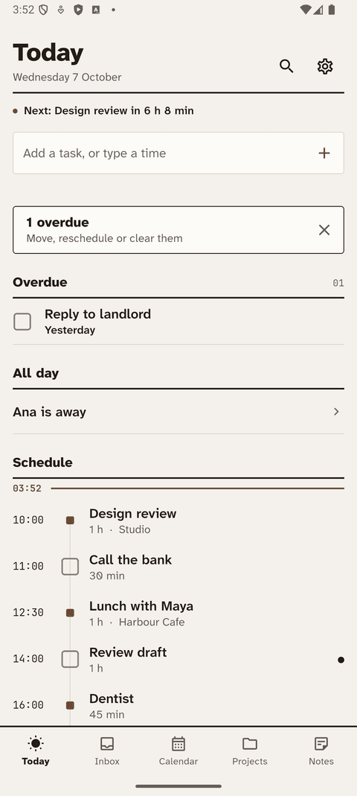
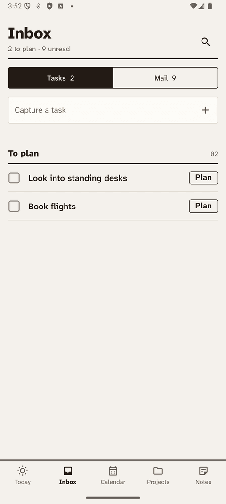
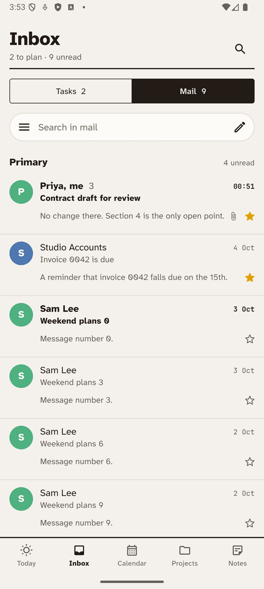
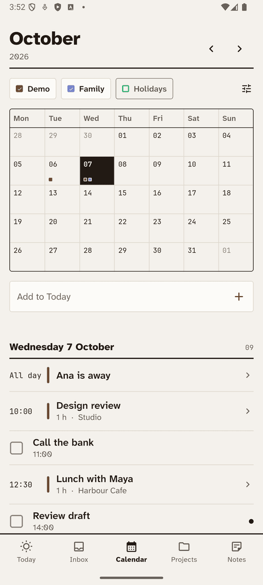

# Cairn

**One quiet place for what to do, what it's for, and what you've written down.**

A calm task and notes app for Android. Works fully offline. Your data stays on your phone.

[**Download the APK**](../../releases/latest) · [Case study](https://portfolio-lemon-sigma-58.vercel.app/work/cairn) · [Privacy](https://adrieltte.github.io/cairn-privacy/)

 

## What it does

- **Today** brings calendar events and tasks into one timeline, with a rescue prompt for anything overdue.
- **Quick add** understands times. Type "call the bank tomorrow 11am" and it lands on the right day.
- **Inbox** catches tasks fast so you can plan them later.
- **Projects and notes** live next to your tasks. Link a note to a task, keep a daily note, duplicate a project.
- **Tags and saved filters**, task checklists, repeats and reminders.
- **Optional Google link-up**: Calendar, Drive backup and Gmail. Each is off until you switch it on.
- No ads, no account, no tracking.

## Install

1. On your phone, open the [latest release](../../releases/latest) and download the `.apk`.
2. Open it. Android asks you to allow installs from your browser or file manager. Allow it for this one install.
3. Tap Install.

Each release lists a SHA-256 checksum if you want to verify the download.

Updates

Install a newer APK over the old one. Your tasks and notes stay. Builds are signed with the same key every time, so updates install cleanly.

[Obtainium](https://github.com/ImranR98/Obtainium) can watch this repo and tell you when a new version is out. Choose Add App and paste this repo's address.

If you installed Cairn from Google Play, delete that copy first. The two are signed with different keys and will not update each other.

Google sign-in

Calendar, Drive and Gmail are optional. They need a Google account and ask for access only when you switch each one on.

## Privacy

Cairn collects nothing. Your data stays on your device unless you connect Google yourself. Read the [privacy policy](https://adrieltte.github.io/cairn-privacy/).

## Feedback

Found a bug or want something added? [Open an issue](../../issues).

Built by [Adriel Tang](https://portfolio-lemon-sigma-58.vercel.app/) with Flutter.
